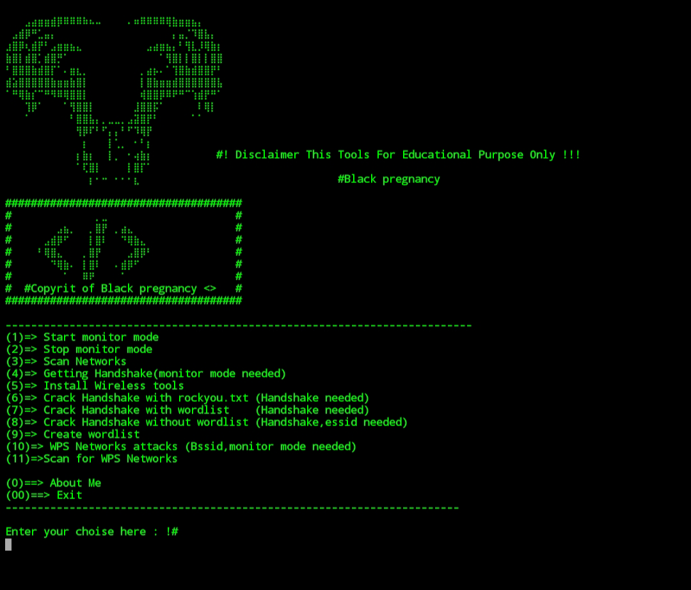

### About
This Tools for Cyber security Using Hacking Wireless all Enc && Cracking Handshake

- python

## Installation

1. Clone the repository:

    ```
    git clone https://github.com/Salvatore00cyber/black-wifi.git 
    ```
## files
2. direct files
  ```
   cd black-wifi
   ```
## Usage

3. Run the script:

    ```
    python3 black-wifi.py
    ```

2. Follow the on-screen instructions to choose an option and provide necessary input.

## Example

Here's an example of how to use the script:


    1)=> Start monitor mode

    2)=> Stop monitor mode

    3)=> Scan Networks   

    4)=> Getting Handshake

    5)=> Create wordlist

    6)=> Install Wireless tools                  

    7)=> WPS Networks attacks 

    8)=> Scan for WPS Networks

    9)=> Crack Handshake with rockyou.txt

    10)=> Crack Handshake with wordlist

    11)=> Crack Handshake without wordlist
# Tested On Hackers :

* Kali Linux

* BlackArch Linux

* Ubuntu

* Kali Nethunter

* Termux ( Rooted Devices)

* Parrot OS
# demo

# Root Termux Installation : 
    apt update 
    apt install git 
    apt install python
    apt install python3
    apt install cmatrix
    git clone https://github.com/Salvatore00cyber/black-wifi.git
    ls
    cd black-wifi 
    python3 black-wifi.py


# Disclaimer :
* black-wifi tool not responsible for misuse and for illegal purposes. Use it only for Pentest or Educational purpose 🏴 !!!
* Hacking is not a crime 
(: ..Pull requests are always welcome.. :)
# Happy Hacking ( Privacy & Security No Such Things Exists in digital World, We Can Hack Everything )
